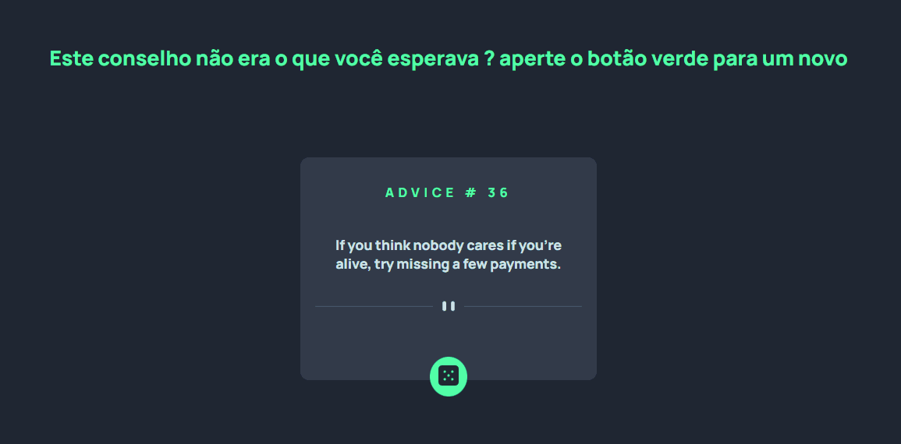

# teste-API 🐱‍💻 

Este é meu primeiro código buscando dados de uma API. Esse algoritimo consiste em  que todo momento que o usuário aperta o botão será gerado um novo conselho a ele.

## Tecnológias utilizadas 
- HTML 🟠
- CSS  🔵
- JAVASCRIPT 🟡